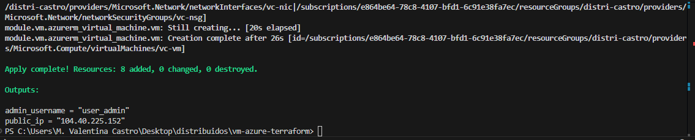
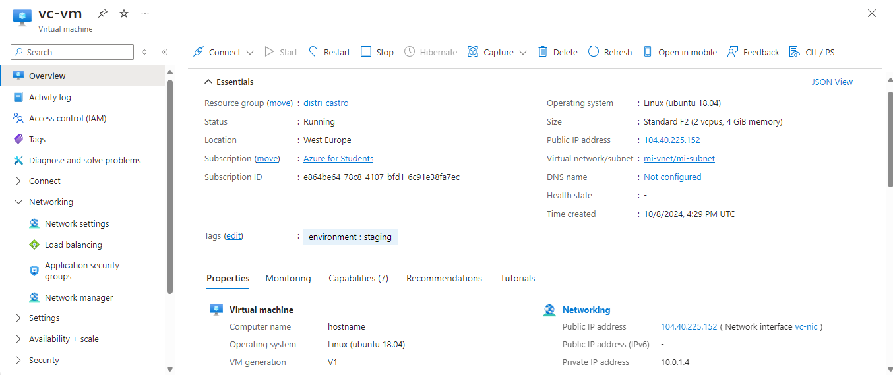

# Informe de Modularización del Código de Terraform

## Descripción General
Se ha realizado la modularización del código de Terraform que aprovisiona una infraestructura en Azure, con el objetivo de seguir mejores prácticas y mejorar la mantenibilidad del código. Los cambios se centraron en separar los recursos relacionados con la creación de la máquina virtual (VM) en un módulo específico.

## Estructura de Archivos

### Estructura antes de la modularización
Anteriormente, todos los recursos (grupo de recursos, red virtual, subred, seguridad, IP pública, interfaz de red y máquina virtual) estaban definidos en el archivo `main.tf` en el directorio raíz, lo que centralizaba la definición de todos los componentes en un único archivo, dificultando la escalabilidad y la legibilidad del código.

### Estructura después de la modularización
Ahora, los recursos se han separado en diferentes archivos y módulos según su responsabilidad:

- **Root Directory:**
  - `main.tf`: Contiene la configuración del provider de Azure, la creación del grupo de recursos, la red virtual, la subred, el grupo de seguridad de red, la IP pública, la interfaz de red y la invocación del módulo `vm`.
  - `variables.tf`: Contiene las variables globales, como el nombre del grupo de recursos, el tamaño de la VM, el nombre de usuario y contraseña del administrador, entre otras.
  
- **Módulo `vm`:**
  - `main.tf`: Contiene la definición de la máquina virtual, utilizando las variables necesarias para la configuración.
  - `variables.tf`: Contiene las variables que serán utilizadas por el módulo, incluyendo el grupo de recursos, la ubicación, el tamaño de la VM, el nombre de usuario, la contraseña y la interfaz de red asociada.

## Cambios Realizados

1. **Separación de Recursos:**
   - Se movieron los recursos relacionados directamente con la creación de la máquina virtual (recurso `azurerm_virtual_machine.vm`) desde el archivo `main.tf` en el root hacia un nuevo archivo `main.tf` dentro del módulo `vm`.
   
2. **Creación del Módulo `vm`:**
   - Se creó un nuevo módulo llamado `vm` en la carpeta `modules/vm`.
   - Este módulo contiene:
     - Un archivo `main.tf` con la definición de la máquina virtual.
     - Un archivo `variables.tf` que declara las variables necesarias para parametrizar el aprovisionamiento de la VM.

3. **Llamada al Módulo en el Root:**
   - En el archivo `main.tf` del root, se incluyó una invocación al módulo `vm` mediante el bloque `module`, especificando los valores necesarios para las variables del módulo (`resource_group_name`, `location`, `network_interface_id`, entre otros).

4. **Actualización de Variables:**
   - Se eliminaron del archivo `variables.tf` del root las variables que ahora son manejadas dentro del módulo `vm`, como `vm_size`, `admin_username`, `admin_password`, etc.
   - En su lugar, estas variables se declaran y se utilizan dentro del módulo `vm`, manteniendo las responsabilidades claramente definidas.

## Ventajas de la Modularización

- **Separación de responsabilidades:** El código ahora está mejor organizado, con los recursos relacionados con la máquina virtual agrupados en un módulo, y los recursos de red, seguridad y otros componentes generales permanecen en el root.
- **Reutilización:** El módulo `vm` se puede reutilizar fácilmente en otros proyectos o en diferentes entornos simplemente modificando los valores de las variables.
- **Mantenibilidad:** Al separar los recursos en módulos, el código es más fácil de leer y mantener, y futuras modificaciones podrán hacerse de forma más localizada sin afectar a otros componentes.

---

## Evidencias 

### Conexión por ssh funciona correctamente

### Visibilidad del recurso en Azure

